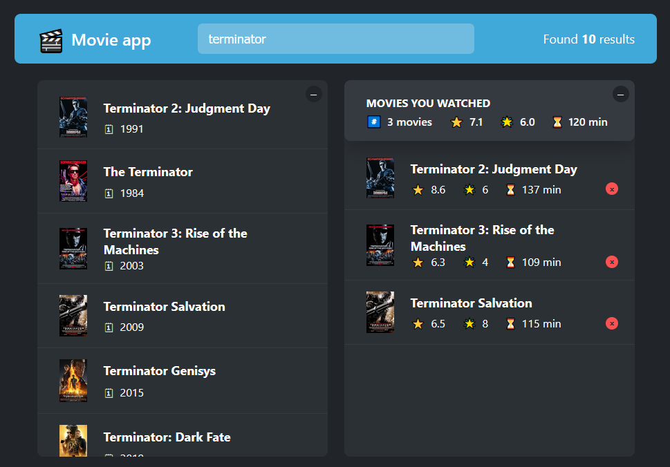
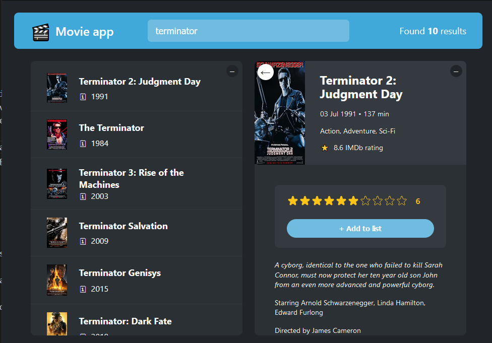

# React - Movie app

# 🔗 [Live Preview](https://main--rainbow-choux-a131e3.netlify.app/)

## About 👋

The **Movie app** project is a React-based movie search and rating application that allows users to search for movies, view details, rate movies, and maintain a list of watched movies. The app interacts with the OMDB API to fetch movie data and uses local storage to persist the list of watched movies across sessions.

It is a simple yet powerful movie search and rating application that demonstrates the use of React hooks, custom hooks, and local storage in a real-world project. The app is highly interactive, with a focus on user experience through features like keyboard shortcuts and persistent storage.

---

## Features 👨‍💻

- **Movie Search**: Users can search for movies by typing in a search query. The app fetches data from the OMDB API and displays a list of matching movies.
- **Movie Details**: Clicking on a movie displays detailed information, including the title, release year, plot, IMDb rating, genre, runtime, and more.
- **User Rating**: Users can rate movies and add them to their watched list. The rating is saved and displayed whenever the movie is revisited.
- **Watched Movies**: The app maintains a list of watched movies with their respective IMDb ratings, user ratings, and runtimes.
- **Local Storage**: Watched movies are stored in the browser's local storage, ensuring that the list persists across sessions.
- **Keyboard Shortcuts**: The app supports keyboard shortcuts, such as closing the movie details view using the Escape key and focusing on the search bar with the Enter key.

---

## How it works ⚙️

#### `App` Component

This is the main component of the application. It manages the state for the search query, selected movie, and watched movies. It also integrates various custom hooks and renders the core layout of the app.

#### `NavBar` Component

This component is the navigation bar of the app. It includes the app logo, search bar, and the number of search results.

#### `Main` Component

A container component that holds the main content of the app, including the search results and watched movies list.

#### `Box` Component

A toggleable container used for collapsing or expanding sections within the app.

#### `MovieList` and `Movie` Components

These components render the list of movies returned from the search and individual movie items, respectively.

#### `MovieDetails` Component

This component displays detailed information about a selected movie. It also allows users to rate the movie and add it to their watched list.

#### `WatchedSummary` Component

Displays a summary of the watched movies, including the average IMDb rating, user rating, and total runtime.

#### `WatchedMovieList` and `WatchedMovie` Components

These components render the list of watched movies and individual watched movie items, respectively.

#### `Loader` and `ErrorMessage` Components

These components handle the loading state and display error messages when the app encounters issues fetching data.

---

## Custom Hooks 🔨

#### `useMovies`

A custom hook that fetches movie data from the OMDB API based on the search query. It handles the loading state, error state, and cancellation of API requests.

#### `useLocalStorageState`

A custom hook that manages state with local storage. It initializes state from local storage and updates local storage whenever the state changes.

#### `useKey`

A custom hook that listens for specific keyboard events and triggers a provided action. It's used for implementing shortcuts like closing the movie details view and focusing on the search bar.

---

## Utility Functions 🔨

#### `average`

A utility function that calculates the average of an array of numbers. It's used to compute average ratings and runtimes in the `WatchedSummary` component.

---

## Languages

- React: functions, conditionals, useState, useEffect, custom hooks, useRef, components...
- Styling: basic CSS
